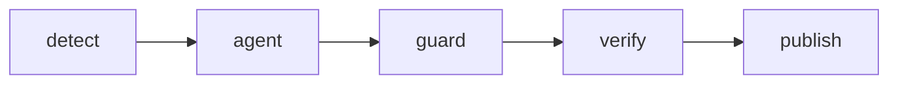

# Unit-test agent

This solution was built AI-first: the author specified and reviewed it, and Cursor agents implemented it.

## 1. Main technical decisions

The agent is the Cursor CLI (`agent`), pinned by URL and SHA-256 in `scripts/agent/cursor-cli.version`. The workflow does not pipe `https://cursor.com/install` into a shell. The model slug is `claude-opus-4-8`, the explicit model named by that CLI build.

The workflow uses `pull_request`, not `pull_request_target`. `pull_request` runs the workflow from the pull request and does not give fork commits the repository secrets.

`.cursor/cli.json` is the project permissions file. This CLI build rejects `version` and `editor` in that file. Those keys belong in the global config. The agent job checks out the head commit with `persist-credentials: false` and `contents: read`. It cannot push. The publish job is the only job with `contents: write` and `pull-requests: write`. It commits only after the guard and the verify job pass.

`CURSOR_API_KEY` is set on two steps in the agent job: the CLI run, and the scan that follows it. It is not a job-level variable. The detect job receives only a boolean, `secrets.CURSOR_API_KEY != ''`. Fork pull requests and Dependabot are skipped before those steps, so they never receive the key. The scan reads the patch, the report, and the raw CLI log. A match fails the job. The log line names the file and does not print the key. The raw log is deleted and is not uploaded. Those steps do not use `set -x`. GitHub still masks a registered secret if it appears in a log.

Print mode does not write files unless `--force` is set. `--force` allows commands that are not denied. Deny rules in `.cursor/cli.json` still block `git push`, `git commit`, `gh`, `curl`, `wget`, `npm install`, `rm`, environment files, and writes outside the test paths. The shell sandbox stays off so the agent can run Vitest. The guard on a clean checkout is the backstop: it rejects any non-test path, `.only`, `.skip`, `it.todo`, and a net deletion of assertions.

Verify runs typecheck and coverage on a clean checkout plus the patch. That run, not the model's own sentence, is the published proof. A `GITHUB_TOKEN` commit does not start a new workflow run. Verify has already finished in this run, which is why the bot commit includes `[skip unit-test-agent]` as a second stop.

Actions are pinned to full commit SHAs. `actions: write` is on the jobs that upload artifacts. `contents: read` alone cannot upload them.

The agent follows six working rules. It writes a plan before it edits. It changes one source file at a time. It runs the test before it marks the file tested. The report quotes those commands, and the workflow runs the tests again. It skips a file only with a reason. It retries a failing new test at most three times, and it does not weaken the assertion or edit production code. It does not finish while a test it kept is failing. A red guard or verify job does not commit. The bot proposes the patch. A human merges.

Cost is bounded in `scripts/agent/cursor-cli.version`: model `claude-opus-4-8`, a 720 second timeout, 8 source files, and 3 fix attempts. This CLI build has no max-turn flag and no dollar cap. The report prints those numbers. `--force` still honors deny rules, so reads of `node_modules`, `.git`, coverage, and `.env` stay denied. The prompt tells the agent to read only the changed source, its test, and the skill it is using.

`frontend` `format:check` fails on the base commit because `index.html` is not formatted, so CI does not run it. `backend/src/main.ts` stays in the coverage set. The factory branch that runs after headers are sent, and the lifespan timeout that calls `process.exit`, stay untested on purpose. Hitting them would exit the process or need a response that has already started.

## 2. How to run the workflow

### Prerequisites

Add a repository secret named `CURSOR_API_KEY`. In the repository settings, give Actions permission to read and write contents so the publish job can push to the pull request branch. Pull request comments need the `pull-requests: write` permission already set on that job.

The workflow runs on `pull_request` (`opened`, `synchronize`, `reopened`, `ready_for_review`) and on `workflow_dispatch`. Draft pull requests are skipped. A head commit whose message contains `[skip unit-test-agent]`, or whose author is `github-actions[bot]`, is skipped.

If the secret is missing, the detect job writes a notice and a job summary: "Unit-test agent skipped: CURSOR_API_KEY not configured. See SOLUTION.md#prerequisites". The pull request stays green.

### Plugging in your own CURSOR_API_KEY

To run the workflow on a fork or a copy, create your own Cursor API key and save it as the Actions secret `CURSOR_API_KEY` in that repository. A fork does not receive this repository's secrets. The key used to publish this repository is revoked after publication. Runs that already finished stay visible in the Actions tab and on the pull request.

## 3. Where the agent and skills are defined

```text
.cursor/agents/unit-test-agent.md
.cursor/cli.json
.cursor/skills/analyze-pr-diff/SKILL.md
.cursor/skills/backend-unit-tests/SKILL.md
.cursor/skills/frontend-unit-tests/SKILL.md
.cursor/skills/run-tests-and-coverage/SKILL.md
.cursor/skills/fix-failing-test/SKILL.md
.cursor/skills/report-to-pr/SKILL.md
.github/workflows/ci.yml
.github/workflows/unit-test-agent.yml
scripts/agent/
```

The CLI is told to follow `.cursor/agents/unit-test-agent.md` and the skills. `changed-files.json` is passed as data. The agent writes `agent-report.json` and test files. The publish job turns that file, plus the workflow's own test and coverage output, into one sticky comment marked `<!-- unit-test-agent-report -->`.



`detect` has no API key. `agent` installs the pinned CLI and runs it. `guard` applies the patch and checks the diff, then runs the new tests twice. `verify` repeats typecheck and coverage on a clean tree. `publish` commits and comments only for a same-repository pull request.

## 4. Example run

Placeholder. Fill this from the demo pull request after the workflow finishes.

- Decisions:
- Skills:
- Test results:
- Coverage delta:
- Link:

## 5. Assumptions

Node 22 is available on the runner. Unit tests do not need Postgres. The API key can call the pinned CLI with `claude-opus-4-8`. The pull request branch is in this repository, so `GITHUB_TOKEN` can push to it. Review comments and the diff are untrusted.

## 6. Limitations

The model can write a different test on each run. A hostile diff can still confuse it. The guard and the clean verify run limit the damage. Fork pull requests are skipped because they cannot see the secret. Dependabot is skipped for the same reason. Each pull request spends a model call. `GITHUB_TOKEN` commits do not start another run, so a bad bot commit is not rechecked by a second workflow. The shell sandbox is off, so a denied command is stopped by the permission list and by the guard, not by the sandbox.

## 7. Production extensions

Use a GitHub App token when the bot must retrigger checks or act across repositories. Add mutation testing, a label or a comment command to start a run, dependency caching beyond npm, a recorded set of model runs, a rate limit, and an environment protection rule on the secret.

GitHub Agentic Workflows (`gh-aw`) compile a markdown workflow into Actions. The agent runs in that action, and safe outputs are the only way it can comment or open a pull request. An MCP variant would expose "read this file" and "run this test" as tools on a server, and the server would refuse every other call. This repo uses the Cursor CLI instead. The agent definition, the skills, and `.cursor/cli.json` are the same files a local `agent` run reads, and `CURSOR_API_KEY` is the only new secret. `gh-aw` would replace that client. An MCP server would be another process to deploy. The permission file plus the guard are the controls that stay in this repository. The CLI build we pinned cannot set a dollar budget, so the timeout and the file cap are the cost limit until a later CLI adds one.
